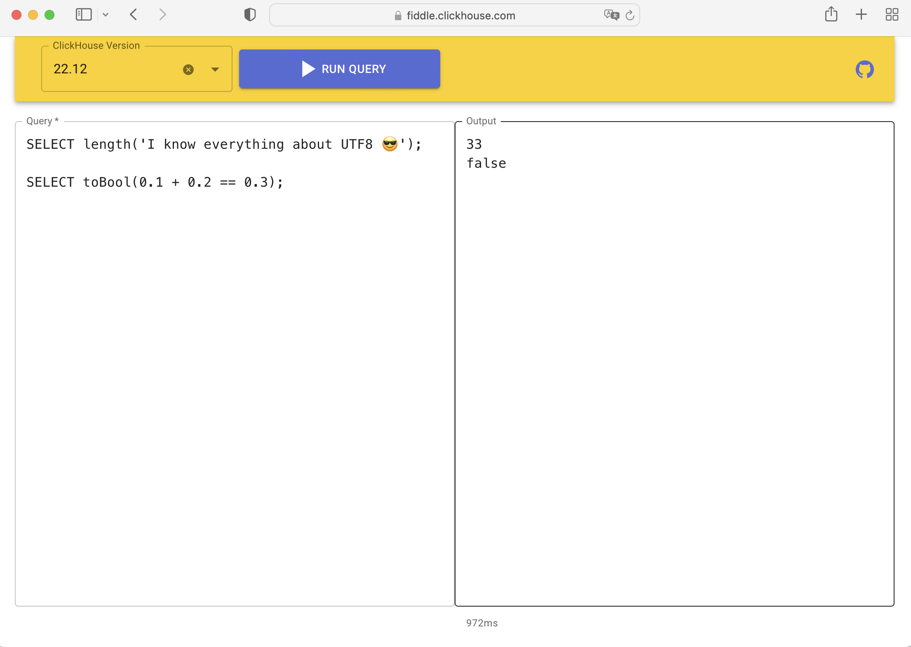
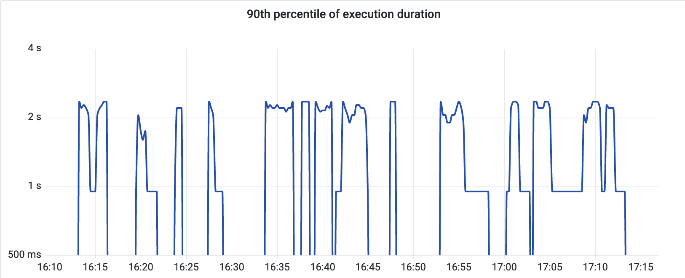
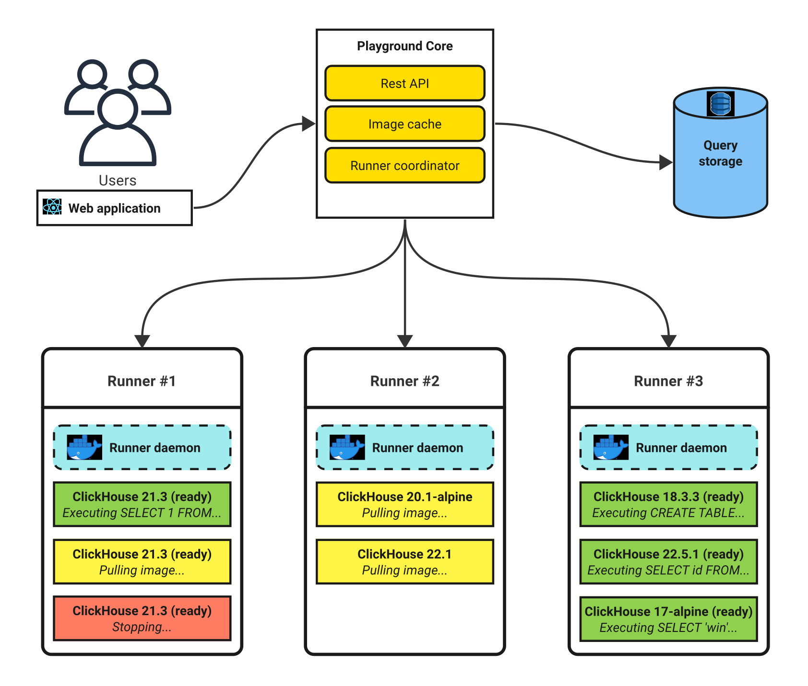
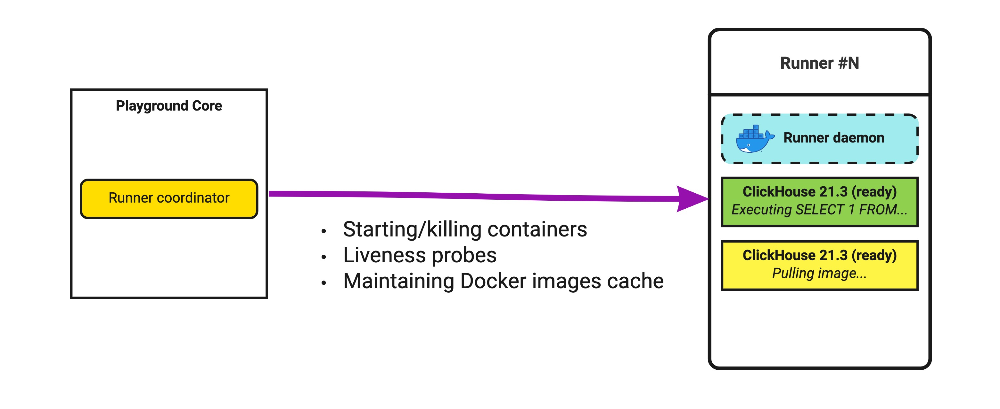

# ClickHouse Fiddle &mdash; a new SQL playground for ClickHouse

Sometimes we want to run SQL queries online to validate them, to share them with other people, or just because we are too lazy to install a database locally. Online SQL playgrounds can help us with this.

A playground allows running SQL queries from a browser without having a database instance on the user's side. In this article, we will talk about a new open-source SQL playground created specifically for ClickHouse &mdash; [ClickHouse Fiddle](http://fiddle.clickhouse.com/). We will cover the motivation and internal architecture of the platform.

## Motivation

If you have never used online playgrounds, a reasonable question might come to mind: what are the use cases of such platforms?

Imagine you need to execute a few queries and see the execution result. For example, you want to know what your favorite database thinks about the truthfulness of the expression `0.1 + 0.2 == 0.3`. If you already have a running database instance, you can connect to it and execute a simple query there. Done. But what if you don't have a running instance? Or maybe the version of the instance you have is not what you want...

Well, then you need to download a binary of the desired version, run it with proper options, and finally execute `SELECT (0.1 + 0.2) == 0.3`... In the modern world of clouds, we can even press a button in a control panel and get a managed instance of the database within minutes (or even seconds).

But we all can agree, that for execution of such contextless queries it's much simpler and faster to open a webpage, type queries there, wait for several seconds and see the execution result. That's what playgrounds offer! A fast and easily accessible way to execute SQL queries from your browser:

_Now we know, `0.1 + 0.2 != 0.3`. Floats..._

In general, an online SQL playground helps in the following cases:

- A database maintainer wants to check whether a bug is reproducible in a particular database version.
- An engineer reads about a new great SQL construct and is interested in whether it's supported in the database version they use (or planning to use).
- Your friend asked you how to do something in SQL and you want to share a snippet of SQL code with the execution result.
- And so on...

Well, now we see the benefits of playgrounds. But why do we need another playground if we already have several of them, even for ClickHouse? The short answer is the limitations of the existing platforms.

Most SQL playgrounds are intended for the emulation of OLTP databases. A transaction is created to execute a bunch of queries. After the execution, the transaction is rollbacked to return to the initial database state. Another way to provide mechanics of an online playground is to allow only read-queries over the existing dataset (that's how ClickHouse Play is implemented). With such an approach, sometimes it's difficult (or even impossible) to get the desired logic of SQL queries.

Furthermore, both of these approaches imply the presence of an always-on database instance for each supported database version.

## Possibilities

In short, ClickHouse Fiddle allows running several SQL queries in an arbitrary version of ClickHouse and provides a unique link to share the results of execution.

Write and DDL queries are also allowed! It means you can create a table, insert some rows and execute a query over them. Data from one execution is not accessible in another run with isolation achieved via containerization (more on this in the design section).

There are some rational limitations on the maximum execution duration and input/output size, but they are not too strict. Users can play with some basic executions to understand the logic of one or another SQL queryset.

Keep in mind, playgrounds are not intended to measure the performance of databases. In case you want to understand how fast is a query, we suggest you run a benchmark in a production-ready instance.

Execution of a simple query on a _hot_ database version usually takes **several seconds** at the moment (p90 is ~2 seconds). We call a version _hot_ if it has already been used recently for another query. Here you can see an example of the 90th percentile of run duration:

## ClickHouse Fiddle Design

Let's discuss how the playground is implemented. The design of Fiddle fits into one picture:

The entry point for users is a simple web application available at [fiddle.clickhouse.com](https://fiddle.clickhouse.com). Users interact with the platform using a HTTP API. All requests are sent to the main component of the system &mdash; playground core.

For each user request a Docker container with the desired ClickHouse version is created. And it's playground core job to distribute the incoming load over available machines and run Docker containers on them.

To optimize the latency of query execution, playground sends liveness probes to runners and collects information about already pulled images. Priority is given to runners with a pulled image when load balancing.

Let's look more precisely at what happens when a user asks the platform to execute a query:

1. Playground core picks an available machine using a load balancing algorithm.
2. If there is no Docker image with the required ClickHouse version on the selected machine, pull it from the registry.
3. Create and run a Docker container.
4. Run provided SQL queries in the container.
5. Wait for the execution of queries and kill the container.
6. Save execution results in the query storage (to allow sharing them by link).
7. Send a response with the fetched data to the user.

Ephemeral containers help to isolate runs from each other via cgroups mechanism. If we compare this approach with always-on database instances, there is latency for image pulling and creating containers, but it requires significantly fewer resources for running the whole platform (1 runner is enough for non-frequent usage).

But there are a lot of orchestration systems: Kubernetes, cloud services, etc. Why did you write yet another container manager? Existing orchestration services provide a huge number of things you can do with containers. And the price for this is their complexity and slowness (within purposes of playgrounds). The written coordinator is faster than orchestration systems because of its simplicity, and it requires fewer computing resources.

## Future work and feedback

Fiddle has a lot of opportunities for improvement:

- frontend features, like SQL syntax highlight
- coordinator distribution algorithm
- database instances with preload datasets
- reducing latency by running containers in advance
- and many many others...

If you want to suggest new improvements or share any other feedback, please create an issue in the[Github repository](https://github.com/lodthe/clickhouse-playground). It's highly appreciated!

And [fiddle.clickhouse.com](https://fiddle.clickhouse.com) is waiting for your queries :)
